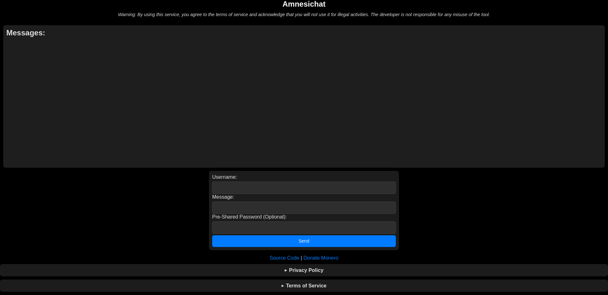

# Amnesichat
## An encrypted and anti-forensic public web chat server
<!-- DESCRIPTION -->
## Description:

Amnesic web chat offers several key benefits, particularly in enhancing user privacy and security. By not retaining conversation histories or user data, amnesic chat systems ensure that sensitive information shared during discussions remains confidential and is not accessible after the chat ends. This ephemeral nature fosters a safer environment for users to express their thoughts without fear of surveillance or data misuse.

## Warning: 

By using this service, you agree to the terms of service and acknowledge that you will not use it for illegal activities. The developer is not responsible for any misuse of the tool.

<!-- FEATURES -->
## Features:

- Client-side E2E message encryption with a pre-shared password

- Server-side room encryption

- Server runs even on cheapest hardware

- Each message is stored in RAM and auto-wiped after 24 hours

- Docker support

- Written in Rust

## Technical details:

- AES-256-CBC for encrypting messages
- PBKDF2 for client-side key derivation
- Argon2id for server-side key derivation

<!-- INSTALLATION -->
## Installation:

    sudo apt update
    sudo apt install curl build-essential git
    curl https://sh.rustup.rs -sSf | sh -s -- -y
    git clone https://github.com/umutcamliyurt/Amnesichat.git
    cd Amnesichat/
    cargo build --release
    cargo run --release

## Run with Docker:
    
    sudo apt update
    sudo apt install docker.io git
    git clone https://github.com/umutcamliyurt/Amnesichat.git
    cd Amnesichat/
    sudo docker build -t amnesichat:latest .
    sudo docker run -p 8080:8080 amnesichat:latest

## Requirements:

- [Tor Browser](https://www.torproject.org/download/) for client
- [Rust](https://www.rust-lang.org) or [Docker](https://www.docker.com/) for server

<!-- SCREENSHOT -->
## Screenshot:

<!-- LICENSE -->
## License

Distributed under the MIT License. See `LICENSE` for more information.
