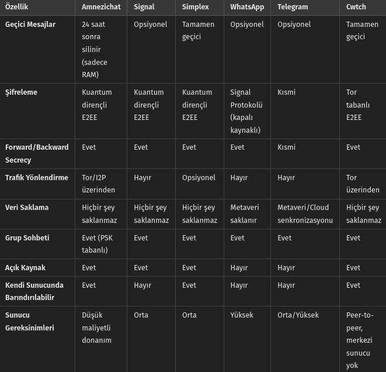
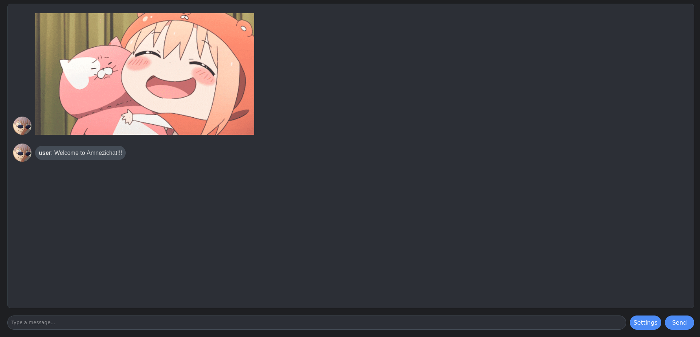

  <a href="README.md">🇺🇸 English</a> |
  <a href="README_TR.md">🇹🇷 Türkçe</a>

# Amnezichat

## İz bırakmayan güvenli mesajlaşma
<!-- AÇIKLAMA -->
## Açıklama:

Amnezichat, hiçbir kayıt tutulmamasını ve tüm mesaj verilerinin yalnızca sunucunun RAM'inde saklanmasını sağlayarak son derece güvenli ve gizlilik odaklı bir mesajlaşma deneyimi sunar. Bu yaklaşım, kullanıcı gizliliğini önemli ölçüde artırır çünkü RAM depolaması doğası gereği geçicidir; sunucu kapatıldığında veya yeniden başlatıldığında veri otomatik olarak silinir ve uçtan uca şifrelenmiş geçmiş iletişimlerin hiçbir izi kalmaz.

<!-- ÖZELLİKLER -->
## Özellikler:

- İstemci tarafında kuantum dirençli uçtan uca mesaj şifreleme

- Bire bir sohbetler için forward ve backward secrecy

- PSK (önceden paylaşılan anahtar) kullanarak grup sohbeti desteği

- En ucuz donanımda bile çalışabilen sunucu

- Her mesaj sunucunun RAM'inde şifreli olarak saklanır ve 24 saat içinde silinir

- Tüm trafik varsayılan olarak Tor/I2P ağı üzerinden yönlendirilir

- Docker desteği

- Rust ile geliştirilmiştir

## Diğer mesajlaşma uygulamalarıyla karşılaştırma tablosu:

## Teknik detaylar:

- Şifreli sahte veriler göndererek ve tüm mesajları sabit bir uzunluğa sabitleyerek AI destekli trafik analizine (DAITA) karşı savunma

- Uçtan uca şifreleme için [Amnezichat Protokolü](PROTOCOL_TR.md)
- Kimlik anahtarlarını, kullanıcı tarafından belirlenen bir şifre ile ChaCha20-Poly1305 ve Argon2id KDF kullanarak yerel depolamada şifreler

### Amnezichat Protokolü:
- Kimlik doğrulama için EdDSA ve Dilithium5, anahtar değişimi için ECDH ve Kyber1024, şifreleme için ChaCha20-Poly1305

<!-- KURULUM -->
## Sunucu kurulumu:

    sudo apt update
    sudo apt install curl build-essential git
    curl https://sh.rustup.rs -sSf | sh -s -- -y
    git clone https://github.com/umutcamliyurt/Amnezichat.git
    cd Amnezichat/server/
    cargo build --release
    cargo run --release

## Docker ile Onion sitesi kurulumu:
    
    sudo apt update
    sudo apt install docker.io git
    git clone https://github.com/umutcamliyurt/Amnezichat.git
    cd Amnezichat/
    sudo docker build -t amnezichat:latest .
    sudo docker run -p 8080:8080 amnezichat:latest

## İstemci kullanımı:

    sudo apt update
    sudo apt install curl build-essential git tor
    sudo systemctl enable --now tor.service
    curl https://sh.rustup.rs -sSf | sh -s -- -y
    git clone https://github.com/umutcamliyurt/Amnezichat.git
    cd Amnezichat/client/
    cargo build --release
    cargo run --release

## Gereksinimler:

- [Rust](https://www.rust-lang.org), [Tor](https://gitlab.torproject.org/tpo/core/tor), [I2P](https://i2pd.website/)

<!-- EKRAN GÖRÜNTÜSÜ -->
## Ekran görüntüsü:

<!-- LİSANS -->
## Lisans

GPLv3 Lisansı altında dağıtılmaktadır. Daha fazla bilgi için `LICENSE` dosyasına bakın.

## Matrix üzerinden [bize katılın!](https://matrix.to/#/#amnezichat_official:matrix.org)

## Bu projenin geliştirilmesini desteklemek için bağış yapın!

**Monero(XMR):** 88a68f2oEPdiHiPTmCc3ap5CmXsPc33kXJoWVCZMPTgWFoAhhuicJLufdF1zcbaXhrL3sXaXcyjaTaTtcG1CskB4Jc9yyLV

**Bitcoin(BTC):** bc1qn42pv68l6erl7vsh3ay00z8j0qvg3jrg2fnqv9
